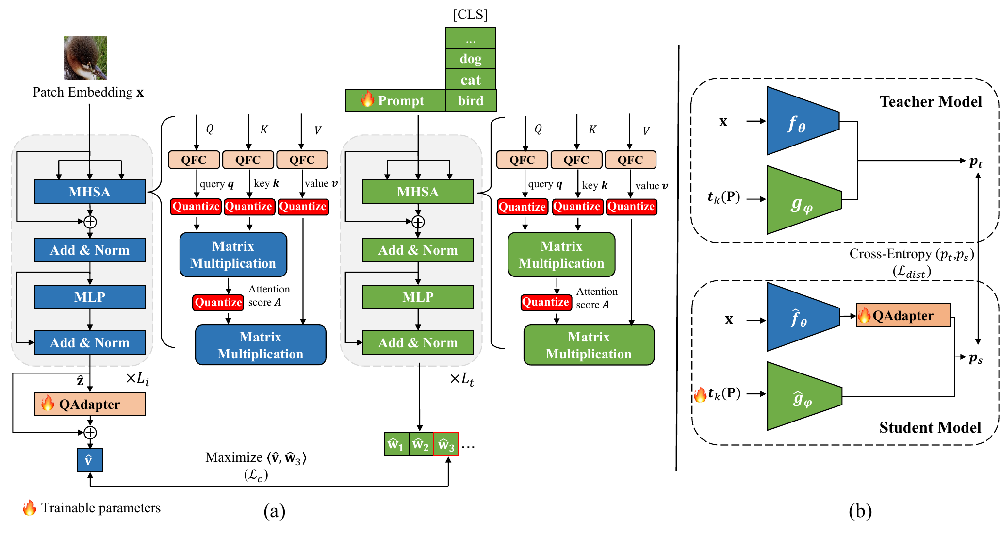

# P4Q: Learning to Prompt for Quantization in Low-Bit CLIP

<p align="center">
  <a href="https://arxiv.org/abs/2409.17634"></a>
</p>

<p align="center">
  <b>Official PyTorch implementation of <a href="https://arxiv.org/abs/2409.17634">P4Q</a></b>
</p>

**P4Q** (Prompt for Quantization) integrates Post-Training Quantization (PTQ) with Parameter-Efficient Fine-Tuning (PEFT) for efficient deployment of vision-language models. Learnable prompts mitigate domain gaps, low-bit adapters realign image and text features, and cosine-similarity distillation transfers knowledge from a full-precision teacher. Across thirteen datasets, P4Q consistently improves low-bit CLIP; for example, 8-bit P4Q on CLIP-ViT/B-32 achieves **66.94%** Top-1 on ImageNet with **4×** model compression.

<p align="center">
  <sub>
    <b>P4Q: Learning to Prompt for Quantization in Low-Bit CLIP</b><br/>
    Huixin Sun, Runqi Wang, Yanjing Li, Chang Gao, Liping Jing, Xiaolong Jiang, Yao Hu, Baochang Zhang, Xianbin Cao<br/>
    <a href="https://arxiv.org/abs/2409.17634">arXiv:2409.17634</a>
  </sub>
</p>

<p align="center">
  
  <br/>
  <em>P4Q framework. (a) Quantized CLIP. (b) Teacher and student distillation.</em>
</p>

## Why P4Q?

- **Restores multimodal alignment** under aggressive low-bit quantization
- **Outperforms FP32 zero-shot CLIP** with only a small prompt and adapter overhead
- **Plug and play** on standard PTQ calibration, compatible with diverse observers and quantizers

## What We Provide

We provide a complete open-source stack for low-bit CLIP quantization research:

- **CLIP PTQ Toolkit**: a modular quantization toolkit built on [FQ-ViT](https://github.com/linyang-zhh/FQ-ViT)-style operators (`models/ptq/`), supporting flexible calibration recipes and bit-width configurations
- **P4Q learning pipeline**: quantization-aware prompt and adapter learning with teacher and student distillation
- **End-to-end scripts**: training, evaluation, and PTQ baseline reproduction on CIFAR-100 with CLIP ViT-B/32
- **Pretrained checkpoints** matching the paper results in Table 1 (CIFAR-100, CLIP ViT-B/32, 4-4-8): `p4q_prompt_learner.pth` (learnable prompt) and `p4q_adapter.pth` (low-bit adapter)

## CLIP PTQ Toolkit

Key components:

| Module | Options |
|--------|---------|
| **Observers** | MinMax, EMA, OMSE, Percentile, PTF |
| **Quantizers** | Uniform, Log2 (LIS softmax) |
| **Q-layers** | `QLinear`, `QConv2d`, `QAct`, `QMultiheadAttention`, `QIntLayerNorm`, `QIntSoftmax` |
| **Bit-width** | `--bit_type {8,4,3,2}` for weight and activation; 8-bit attention |

Default recipe for CIFAR-100 under the 4-4-8 setting: MinMax channel-wise weight quantization, OMSE activation quantization, and 8-bit attention.

```bash
python main.py --model ViT-B/32 --db_name cifar100 --root ./data \
    --quant --bit_type 4 \
    --calib-iter 10 --zeroshot_prompt --val_quant --num-workers 0
```

## Released Results (CIFAR-100, ViT-B/32, 4-4-8)

| Method | Top-1 | Top-5 |
|--------|-------|-------|
| FP32 CLIP (zero-shot) | 65.34 | 89.00 |
| PTQ baseline (OMSE) | 46.05 | 74.47 |
| **P4Q** | **69.20** | **91.26** |

The released checkpoints reproduce the P4Q result above:

| Checkpoint | Component | Role |
|------------|-----------|------|
| `p4q_prompt_learner.pth` | Learnable prompt | Embeds downstream knowledge to mitigate domain gaps |
| `p4q_adapter.pth` | Low-bit adapter | Realigns image and text feature distributions |

Load both files from [`checkpoints/p4q/`](checkpoints/p4q/) and run `bash scripts/test_p4q.sh` for evaluation.

## Quick Start

```bash
conda create -n p4q python=3.10 -y && conda activate p4q
pip install -r requirements.txt

# Place CIFAR-100 under data/cifar-100-python/{meta,train,test}

bash scripts/test_baseline.sh   # PTQ baseline
bash scripts/test_p4q.sh        # P4Q evaluation
bash scripts/train_p4q.sh       # train P4Q
```

## Citation

```bibtex
@article{sun2024p4q,
  title   = {P4Q: Learning to Prompt for Quantization in Visual-language Models},
  author  = {Sun, Huixin and Wang, Runqi and Li, Yanjing and Gao, Chang and Jing, Liping and Jiang, Xiaolong and Hu, Yao and Zhang, Baochang and Cao, Xianbin},
  journal = {arXiv preprint arXiv:2409.17634},
  year    = {2024}
}
```

## Acknowledgements

[CLIP](https://github.com/openai/CLIP), [CoOp](https://github.com/KaiyangZhou/CoOp), [CLIP-Adapter](https://github.com/gaopengcuhk/CLIP-Adapter), and [FQ-ViT](https://github.com/linyang-zhh/FQ-ViT).

## License

See [LICENSE](LICENSE).
