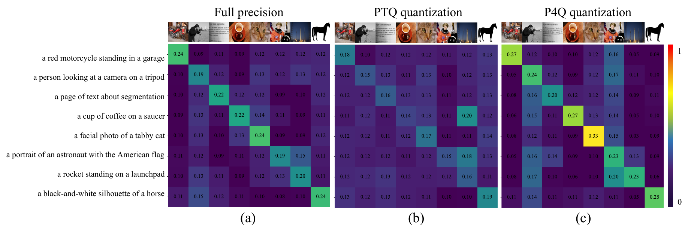

# P4Q: Learning to Prompt for Quantization in Low-Bit CLIP

Official PyTorch implementation of [**P4Q**](https://arxiv.org/abs/2409.17634).

> **P4Q: Learning to Prompt for Quantization in Low-Bit CLIP**  
> Huixin Sun, Runqi Wang, Yanjing Li, Chang Gao, Liping Jing, Xiaolong Jiang, Yao Hu, Baochang Zhang, Xianbin Cao  
> [arXiv:2409.17634](https://arxiv.org/abs/2409.17634)

<p align="center">
  
  <br/>
  <em>Figure 1. Image–text cosine similarity. PTQ breaks alignment (b); P4Q restores it (c).</em>
</p>

<p align="center">
  
  <br/>
  <em>Figure 2. P4Q framework: quantized CLIP (a) and teacher–student distillation (b).</em>
</p>

## CLIP PTQ Engine

Built on [FQ-ViT](https://github.com/linyang-zhh/FQ-ViT)-style operators (`models/ptq/`):

| Module | Support |
|--------|---------|
| **Observers** | MinMax, EMA, OMSE, Percentile, PTF |
| **Quantizers** | Uniform, Log2 (LIS softmax) |
| **Q-layers** | `QLinear`, `QConv2d`, `QAct`, `QMultiheadAttention`, `QIntLayerNorm`, `QIntSoftmax` |
| **Bit-width** | `--bit_type {8,4,3,2}` for W/A; attention at 8-bit |

Default recipe (CIFAR-100, 4-4-8): weight MinMax (channel-wise), activation OMSE (channel-wise), attention 8-bit.

```bash
python main.py --model ViT-B/32 --db_name cifar100 --root ./data \
    --quant --bit_type 4 --quant-method omse \
    --calib-iter 10 --zeroshot_prompt --val_quant --num-workers 0
```

## Released Results (CIFAR-100, ViT-B/32, 4-4-8)

| Method | Top-1 | Top-5 |
|--------|-------|-------|
| FP32 CLIP (zero-shot) | 65.34 | 89.00 |
| PTQ baseline (OMSE) | 46.05 | 74.47 |
| **P4Q** | **69.20** | **91.26** |

Checkpoints: [`checkpoints/p4q/`](checkpoints/p4q/)

## Quick Start

```bash
conda create -n p4q python=3.10 -y && conda activate p4q
pip install -r requirements.txt

# data: data/cifar-100-python/{meta,train,test}

bash scripts/test_baseline.sh   # PTQ baseline
bash scripts/test_p4q.sh        # P4Q evaluation
bash scripts/train_p4q.sh       # train P4Q
```

## Project Layout

```
P4Q/
├── main.py
├── config.py
├── models/{ptq,clip,clip_vit_quant.py,dq_qadapt_coop.py}
├── figures/
├── scripts/
└── checkpoints/p4q/
```

## Citation

```bibtex
@article{sun2024p4q,
  title   = {P4Q: Learning to Prompt for Quantization in Visual-language Models},
  author  = {Sun, Huixin and Wang, Runqi and Li, Yanjing and Cao, Xianbin and Jiang, Xiaolong and Hu, Yao and Zhang, Baochang},
  journal = {arXiv preprint arXiv:2409.17634},
  year    = {2024}
}
```

## Acknowledgements

[CLIP](https://github.com/openai/CLIP) · [CoOp](https://github.com/KaiyangZhou/CoOp) · [CLIP-Adapter](https://github.com/gaopengcuhk/CLIP-Adapter) · [FQ-ViT](https://github.com/linyang-zhh/FQ-ViT)

## License

See [LICENSE](LICENSE).
